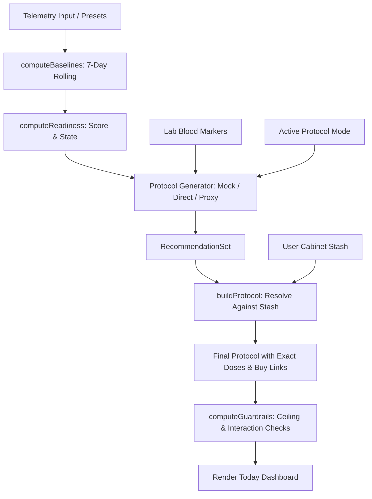

# NutriSync AI — Architecture Overview

NutriSync AI is architected as an **on-device first, privacy-preserving mobile/web application** built with React Native (Expo) and an optional FastAPI backend proxy.

---

## 1. High-Level System Design

```
+-----------------------------------------------------------------------------------+
|                                  NUTRISYNC AI CLIENT                              |
+-----------------------------------------------------------------------------------+
|  [Presentation Layer]                                                             |
|  - Expo Router v6 (File-based tabs: Today, Stash, Trends, Settings + Modals)      |
|  - Custom Material-3 / Clinical Dual Theme Token System                          |
|  - Reanimated Motion + SVG Data Visualizations (ReadinessRing, LineChart)         |
+-----------------------------------------------------------------------------------+
|  [State & Business Logic Layer]                                                   |
|  - Zustand Central Store (useStore.ts)                                            |
|  - Biometric Engine (baselines.ts, readiness.ts)                                  |
|  - Dosing & Guardrails Engine (protocolEngine.ts, guardrails.ts)                  |
|  - Adherence & Procurement Services (adherence.ts, procurement.ts)               |
+-----------------------------------------------------------------------------------+
|  [Storage & Persistence Layer]                                                    |
|  - SQLite (Native: expo-sqlite) / IndexedDB-backed AsyncStorage (Web)             |
|  - Hardware-backed Key Storage (Native: expo-secure-store / Web: storage)         |
+-----------------------------------------+-----------------------------------------+
                                          | (Optional AI Calls)
                                          v
+-----------------------------------------------------------------------------------+
|                                    AI CHANNELS                                    |
+-------------------------+-------------------------------+-------------------------+
|  Channel A: Client-Only |  Channel B: Direct BYOK       |  Channel C: Proxy       |
|  - Offline Mock Engine  |  - Direct Gemini 2.0 Flash    |  - FastAPI (server.py)  |
|  - 100% Deterministic   |  - Direct GPT-4o-mini         |  - Emergent Universal   |
|  - 0 Network Latency    |  - Keys stored on device only |    LLM Key (GPT-5.4/    |
|                         |                               |    Gemini 3.1 Pro)      |
+-------------------------+-------------------------------+-------------------------+
```

---

## 2. Directory Structure

```
NutriSync-AI/
├── backend/                  # FastAPI Python backend proxy
│   ├── tests/                # Pytest suites (health, OCR, protocol)
│   ├── .env                  # Backend configuration (PORT, HOST, MONGO_URL)
│   ├── pyproject.toml        # uv package configuration
│   ├── requirements.txt      # Python dependencies
│   └── server.py             # FastAPI entrypoint and proxy routes
├── docs/                     # Comprehensive project documentation
│   ├── README.md             # Documentation index
│   ├── architecture.md       # This file
│   ├── features.md           # User feature catalog
│   ├── biometrics_and_engine.md # Algorithm & math specifications
│   ├── api_reference.md      # API endpoints and schemas
│   ├── design_system.md      # Design guidelines & theme tokens
│   └── local_development.md  # Setup and execution guide
├── frontend/                 # React Native / Expo application
│   ├── app/                  # Expo Router file-based screens
│   │   ├── (tabs)/           # Main bottom tabs (index, stash, trends, settings)
│   │   ├── _layout.tsx       # Root layout, font registration, toast wrapper
│   │   ├── breath.tsx        # 2-minute cyclic sighing full-screen modal
│   │   └── scan.tsx          # Camera / Library OCR & manual add modal
│   ├── assets/               # Local fonts and icons
│   ├── src/
│   │   ├── components/       # Reusable UI widgets (ReadinessRing, ChronoCard, etc.)
│   │   ├── data/             # Compound dictionary, default stash, presets
│   │   ├── hooks/            # Icon and font hooks
│   │   ├── services/         # Biometrics, AI, database, guardrails, procurement
│   │   ├── store/            # Zustand global state (useStore.ts)
│   │   ├── theme/            # Dual-theme color tokens and hook (tokens.ts, useTheme.ts)
│   │   ├── types.ts          # Central TypeScript interfaces & enums
│   │   └── utils/            # Haptics, storage abstraction (index.ts / index.web.ts)
│   ├── app.json              # Expo application manifest
│   ├── metro.config.js       # Metro bundler configuration
│   └── package.json          # Node dependencies and scripts
└── design_guidelines.json    # Design aesthetics and component tokens
```

---

## 3. Client-Side Data & State Management

### 3.1 Zustand Store (`useStore.ts`)
The entire application lifecycle is driven by a single unified reactive store:

```typescript
interface AppState {
  hydrated: boolean;
  settings: Settings;
  stash: StashItem[];
  telemetry: TelemetryDay[];
  intake: IntakeLog[];
  baselines: Baselines | null;
  readiness: Readiness | null;
  protocol: Protocol | null;
  generating: boolean;
  keys: { gemini: string; openai: string };
  adherenceDates: string[];
  bloodMarkers: BloodMarker[];
  // Actions: hydrate, reanalyze, setMode, addStashItem, toggleIntake, etc.
}
```

### 3.2 Dual-Tier Storage Layer
1. **Key-Value Store**:
   - **Native**: `expo-sqlite` creating a persistent table `kv (key TEXT PRIMARY KEY, value TEXT)`.
   - **Web**: `AsyncStorage` backed by browser `IndexedDB`.
2. **Secure Credentials**:
   - **Native**: `expo-secure-store` storing user Gemini and OpenAI API keys in the device keychain/keystore.
   - **Web**: Fallback to isolated storage.

---

## 4. Dosing Pipeline & Data Flow



1. **Telemetry & Baselines**: Today's metrics (Deep Sleep, HRV, Strain, Resting HR) are computed against the prior 7-day rolling window.
2. **Readiness Evaluation**: Computes percentage deltas and classifies state (`optimal`, `balanced`, `recovery`, `stress`).
3. **Recommendation Synthesis**:
   - High-strain days prioritize glycogen and phosphocreatine replenishment (Creatine, Electrolytes).
   - Poor-sleep or low-HRV days prioritize GABA-ergic and autonomic support (Magnesium Glycinate, Glycine, L-Theanine).
   - Lab-flagged deficiencies take highest priority.
4. **Cabinet Resolution**: Matches recommended compounds against active shelf items, calculating exact capsule counts per dose.
5. **Guardrail Validation**: Verifies combined daily ceilings and flags nutrient competition before presentation.
